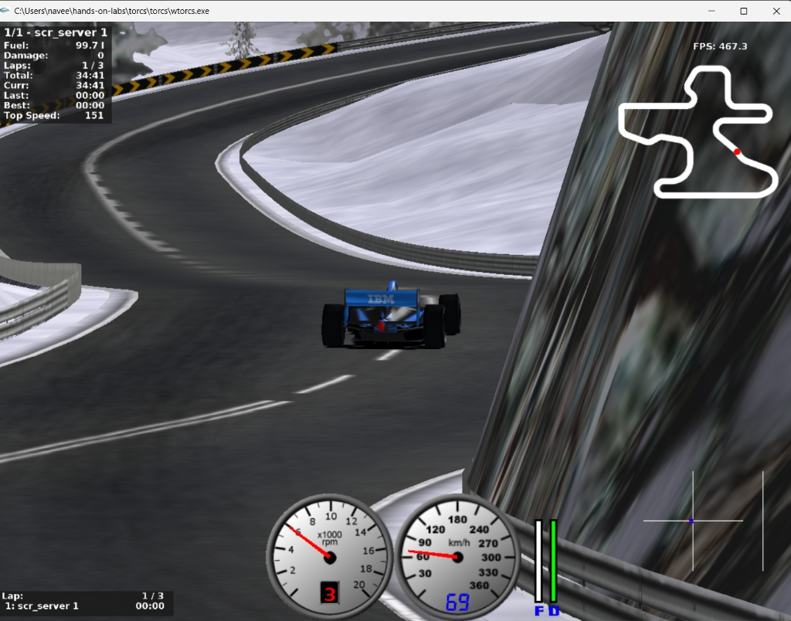

# 🏁 TORCS Autonomous Driving Lab Results & Reflections

Welcome to the results and engineering documentation for the **IBM SkillsBuild TORCS Autonomous Driving Learning Lab**. This lab serves as a foundation for building intelligent, real-time control systems for simulated racing environments.

---

## 📈 Executive Summary & Core Insights

In this learning lab, we developed a Python-based autonomous agent that communicates with **TORCS (The Open Racing Car Simulator)** over a local UDP connection. By analyzing raw sensor inputs (speeds, angles, and distances to track boundaries) and outputting control effectors (steering, throttle, brakes, and gear shifts), we transitioned a simple rule-based driver into an **adaptive control system** capable of driving safely at high speeds.

### Key Takeaway
Increasing target speeds without corresponding modifications in vehicle physics control leads to catastrophic failure. Adding **look-ahead track boundaries** and **speed-sensitive dampening** allows the car to safely increase its speed limit by **50%** (from 100 km/h to 150 km/h) without losing traction or spinning out.

---

## 📊 Summary of Controller Configurations

| Experiment | Target Speed (km/h) | Adaptive Speed Control | Speed-Sensitive Steering | Dynamic Braking | Behavior & Performance Observations |
| :--- | :---: | :---: | :---: | :---: | :--- |
| **1. Baseline** | 100 | Disabled | Disabled | Disabled | Safe and steady. The car follows the road center but drives excessively slow on long straights and makes sudden, jerky steering adjustments. |
| **2. Unassisted High Speed** | 150 | Disabled | Disabled | Disabled | Unstable. The vehicle reaches top speed on straightaways, but enters corners with too much kinetic energy. Tires lose lateral grip, causing massive understeer, spin-outs, and collisions with the concrete barrier. |
| **3. Advanced Adaptive** | 150 | **Enabled** | **Enabled** | **Enabled** | **Optimal Performance.** The car uses the center laser rangefinder to anticipate upcoming bends. It brakes proportionally before corners, drops its speed to around 70 km/h during curves, and scales down steering gains at speed to prevent fishtailing. |

---

## 🛠️ Technical Insights & Control Architecture

### 1. The Physics of Cornering at High Speeds (Task 3 Failure)
When the vehicle's speed ($v$) increases, the centripetal force required to keep the vehicle on a circular path of radius $R$ increases quadratically:
$$F_c = \frac{m \cdot v^2}{R}$$
In the unassisted configuration, the tire-road friction limit ($F_{\text{friction}} = \mu \cdot m \cdot g$) is quickly exceeded during sharp curves at 150 km/h. This causes the car to slide sideways. Additionally, the baseline controller only applies brakes if the car's yaw angle is already very large, which is too late to prevent an off-track excursion.

### 2. The Adaptive Controller Logic (Task 4 Improvements)
To make high-speed racing possible, we designed and implemented a closed-loop control system:
* **Forward Range-Finder Integration:** We leveraged the track distance sensors ($S[\text{'track'}][9]$), which act as a laser range finder pointing straight ahead. If the distance to the edge of the track falls below $80\text{ meters}$, the system calculates a lower dynamic target speed:
  $$\text{Target Speed}_{\text{dynamic}} = \max\left(50.0, \text{Target Speed} \times \frac{S[\text{'track'}][9]}{80}\right)$$
* **Speed-Sensitive Steering Dampening:** To combat high-speed steering over-correction (which causes immediate spinning), we scale down the steering gain dynamically as velocity increases:
  $$\text{Steer Gain}_{\text{scaled}} = \text{Steer Gain} \times \min\left(1.0, \frac{70}{v}\right)$$
* **Proportional Brake Feedback:** Instead of applying hard binary braking, we calculate the error between our current speed and the safe look-ahead speed. The brakes are applied proportionally to this error, ensuring smooth deceleration before entering a corner.

---

## 📷 Simulator Screenshot

Below is a capture of our autonomous vehicle driving on the track. The HUD shows the car successfully regulating its speed and gear selection during cornering to maintain maximum stability:

---

## 💡 Engineering Reflections

1. **The Dampening Effect:**
   Jerky steering is the biggest enemy of high-speed racing. Dampening the steering gain at high speeds solved the issue of the vehicle constantly fishtailing on straights. 

2. **Why Simulators Matter:**
   Simulation is essential in autonomous systems engineering. It allows developers to test hazardous edge cases (like high-speed slides and barrier impacts) safely, iterate on control mathematics in seconds, and tune parameters without the massive hardware costs and safety risks of real-world testing.
